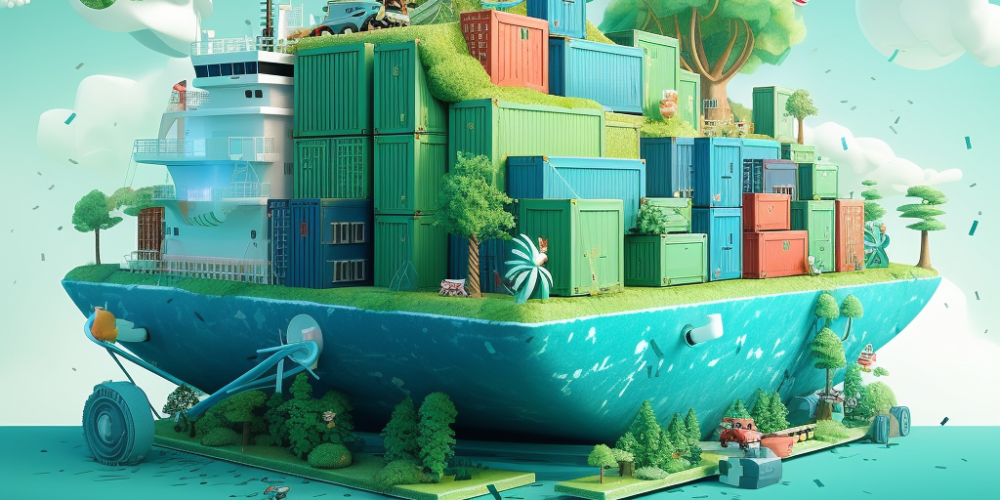

# Green Docker

Make the most efficient Docker image using best practices

Cut back on greenhouse emissions by writing good code

Please &#9733; this repo if you found it useful &#9733; &#9733; &#9733;

Start by reading the [Dockerfile Guide](DOCKERFILE_GUIDE.md)

[Watch the Video](https://www.youtube.com/watch?v=2-wR_balsH0&t=525s)

## Features

* Pass SIGINT signal
* Package management
* Tiny base using Alpine
* Maximum cached layers

## Dependencies

[Docker](https://docker.com)

## Support

Submit an [issue](https://github.com/jamrizzi/readme/issues/new)

## Screenshots

## Contributing

1. Fork it!
2. Create your feature branch: `git checkout -b my-new-feature`
3. Commit your changes: `git commit -m 'Add some feature'`
4. Push to the branch: `git push origin my-new-feature`
5. Submit a pull request :D

## License

[MIT License](https://github.com/jamrizzi/readme/blob/master/LICENSE)

[Jam Risser](https://jamrizzi.com) &copy; 2017

## Credits

* [Jam Risser](https://jamrizzi.com) - Author
* [Docker](https://docs.docker.com/engine/reference/builder)

## Changelog

0.0.1 (2017-04-28)
* Initial release

## Support on Beerpay (actually, I drink coffee)

A ridiculous amount of coffee :coffee: :coffee: :coffee: was consumed in the process of building this project.

[Add some fuel](https://beerpay.io/jamrizzi/green-docker) if you'd like to keep me going!

  
